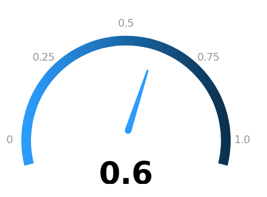
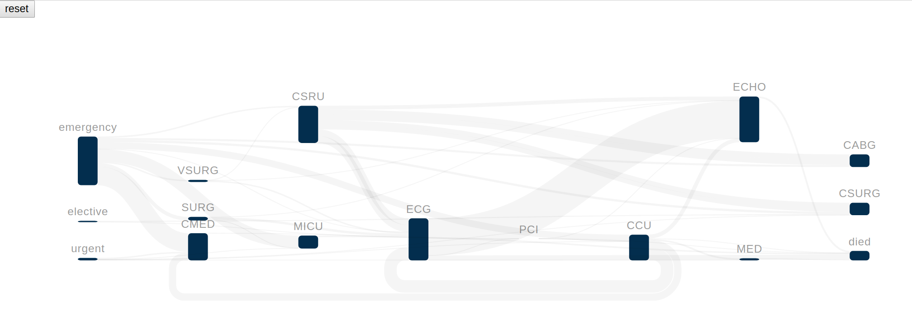
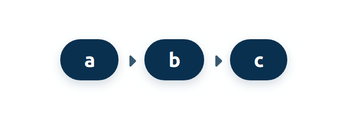
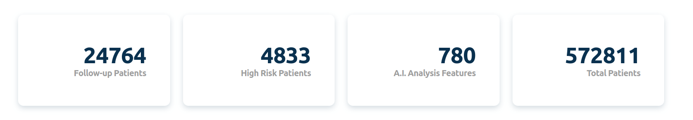
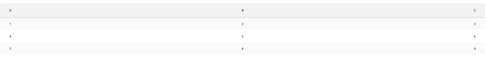
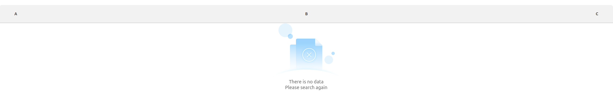
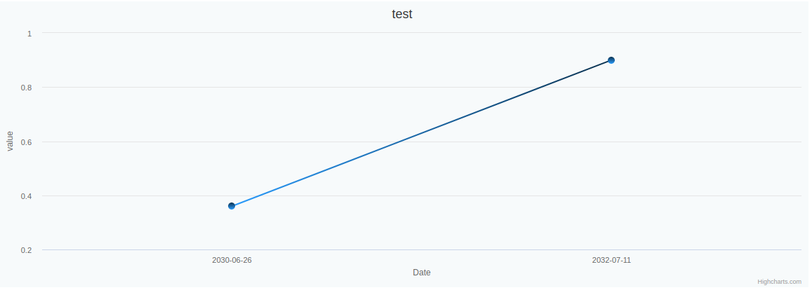
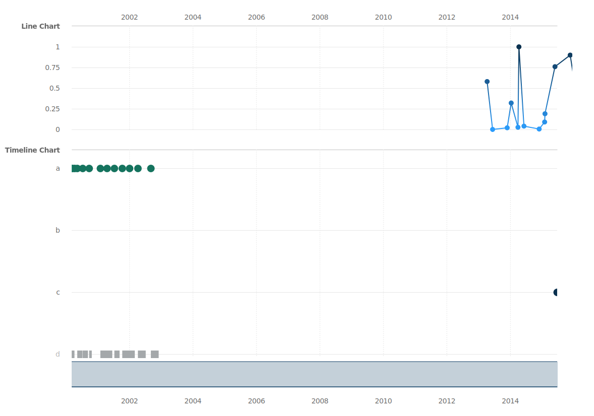
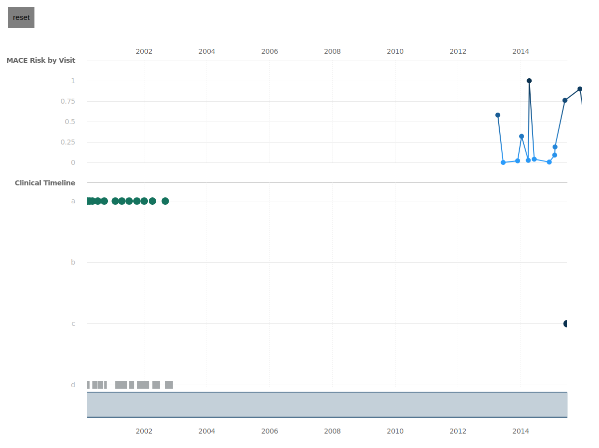

# MDwalks-UI

**[Release Notes / History / Changes](CHANGELOG.md)**

## 1. How to
* install
  ```bash
  yarn
  ```

* build from source
  ```bash
  yarn build
  ```

* run storybook
  ```bash
  yarn storybook
  ```

## 2. Usage

* ### BarGauge Component

  
  
  ```javascript
  import BarGauge from '<BarGauge Path>'

  const App = () => {
    return (
      <div>
        <BarGauge score={60} />
      </div>
    )
  }
  ```

  * ### Props

   |  Name |  Type  | Default | Range   |  Description        | 
   |:------|:-------|:--------|:------- |:--------------------|
   | score | Number |         | 0 ~ 100 | BarGauge fill width | 


* ### RadiusGauge Component

  
  
  ```javascript
  import RadiusGauge from '<RadiusGauge Path>'

  const App = () => {
    return (
      <div>
        <RadiusGauge score={0.6} />
      </div>
    )
  }
  ```

  * ### Props

   |  Name |  Type  | Default | Range   |  Description        | 
   |:------|:-------|:--------|:------- |:--------------------|
   | score | Number |         | 0 ~ 1   | RadiusGauge Pin Position |
   | width | Number |         | 0 ~ Infinity | RadiusGauge Horizontal Area |
   | height | Number |        | 0 ~ Infinity | RadiusGauge Vertical Area | 


* Sankey Chart Component

  

  ```javascript
  import SankeyChart from '<SankeyChart Path>'
  import data from '<SankeyChart Data Path>'
  const App = () => {
    eventHandler = () => {
      console.log('hello')
    }

    return (
      <div>
        <SankeyChart data={data} onNodeClick={this.eventHandler} />
      </div>
    )
  }
  ```
  * ### Props

   |  Name |  Type  | Default |  Description        | 
   |:------|:-------|:--------|:--------------------|
   | data | Object |         | SankeyChart Data |
   | onNodeClick | Function |         | SankeyChart Node Click Event Handler |
   | onLinkClick | Function |         | SankeyChart Link Click Event Handler | 


* ### SelectedCard Component

  
  
  ```javascript
  import SelectedCard from '<SelectedCard Path>'
  
  const App = () => {
    return (
      <div>
        <SelectedCard selectedElement={['a', 'b', 'c']} />
      </div>
    )
  }
  ```

    * ### Props

   |  Name |  Type  | Default | Description        | 
   |:------|:-------|:--------|:--------------------|
   | selectedElement | Array |   []    | Text Collection of Card Element |


* ### SummaryCard Component

  
  
  ```javascript
  import SummaryCard from '<SummaryCard Path>'

  const App = () => {
    return (
      <div>
        <SummaryCard  
          data={{
            "Follow-up Patients": 24764,
            "High Risk Patients": 4833,
            "A.I. Analysis Features": 780,
            "Total Patients": 572811
          }}
        />
      </div>
    )
  }
  ```

  * ### Props
   |  Name |  Type  | Default | Description        | 
   |:------|:-------|:------- |:--------------------|
   | data | Object |         | Summary Card Information |


* ### Table

  
  
  
  ```javascript
  import Table from '<Table Path>'

  const App = () => {
    return (
      <div>
        <Table 
          data={{
            headers: ['a', 'b', 'c'],
            rowData: [
              {
                'a': 1,
                'b': 2,
                'c': 3
              },
              {
                'a': 4,
                'b': 5,
                'c': 6
              },
              {
                'a': 7,
                'b': 8,
                'c': 9
              },
            ]
          }} 
        />
      </div>
    )
  }
  ```

  * ### Props
   |  Name |  Type  | Default | Description        | 
   |:------|:-------|:------- |:--------------------|
   | data | Object |         | Table Information |


* ### Line Chart Component

  

  ```javascript
  import LineChart from '<LineChart Path>'
  const App = () => {
    return (
      <div>
        <LineChart
          title={'test'}
          data={[
            {
              "name": "value",
              "data": [
                0.36,
                0.9,
              ]
            }
          ]}
          xAxisCategory={[
            "2030-06-26",
            "2032-07-11",
          ]}
          xAxisTitle={'Date'}
          xAxisTitleAlign={'middle'}
          yAxisTitle={'value'}
          yAxisTitleAlign={'middle'}  
        />
      </div>
    )
  }
  ```

  * ### Props
   |  Name |  Type  | Default | Description        | 
   |:------|:-------|:------- |:--------------------|
   | title | String | 'Line Chart' | Line Chart Title |
   | data | Array |  []   | Line Chart Data |
   | xAxisCategory | Array |         | Line Chart XAxis Category |
   | xAxisTitle | String | 'xAxis' | Line Chart XAxis Title |
   | xAxisTitleAlign | String | 'middle' | Line Chart XAxis Title Position |
   | yAxisTitle | String | 'yAxis' | Line Chart YAxis Title |
   | yAxisTitleAlign | String | ''middle' | Line Chart YAxis Title Position |

* ### Timeline Component

  

  ```javascript
  import Timeline from '<Timeline Path>'
  const timelineData = [
    {
      "dataPoints": [
        {
          startTime: "2000-03-08T15:43:00",
          endTime: "2000-03-09T13:51:00"
        },
        {
          startTime: "2000-03-09T13:52:00",
          endTime: "2000-03-11T13:52:00"
        },
        {
          startTime: "2000-03-17T09:00:00",
          endTime: "2000-03-17T09:00:00"
        },
        {
          startTime: "2000-04-11T09:30:00",
          endTime: "2000-04-11T09:30:00"
        },
        {
          startTime: "2000-05-12T10:15:00",
          endTime: "2000-05-12T10:15:00"
        },
        {
          startTime: "2000-07-14T09:15:00",
          endTime: "2000-07-14T09:15:00"
        },
        {
          startTime: "2000-09-26T11:01:00",
          endTime: "2000-09-26T11:01:00"
        },
        {
          startTime: "2001-02-02T09:00:00",
          endTime: "2001-02-02T09:00:00"
        },
        {
          startTime: "2001-04-20T09:00:00",
          endTime: "2001-04-20T09:00:00"
        },
        {
          startTime: "2001-07-13T09:00:00",
          endTime: "2001-07-13T09:00:00"
        },
        {
          startTime: "2001-10-12T09:00:00",
          endTime: "2001-10-12T09:00:00"
        },
        {
          startTime: "2002-01-04T09:15:00",
          endTime: "2002-01-04T09:15:00"
        },
        {
          startTime: "2002-04-10T16:00:00",
          endTime: "2002-04-10T16:00:00"
        },
        {
          startTime: "2002-07-20T20:36:00",
          endTime: "2002-07-20T21:40:00"
        },
        {
          startTime: "2002-09-06T13:40:00",
          endTime: "2002-09-06T13:40:00"
        }
      ],
      "label": [
        "a"
      ],
      "order": 0
    },
    {
      "dataPoints": [],
      "label": [
        "b"
      ],
      "order": 1
    },
    {
      "dataPoints": [
        {
          "startTime": "2015-06-26T00:00:00",
          "endTime": "2015-06-26T00:00:00"
        }
      ],
      "label": [
        "c"
      ],
      "order": 2
    },
    {
      "dataPoints": [
        {
          startTime: "2000-03-09T00:00:00",
          endTime: "2000-04-10T00:00:00"
        },
        {
          startTime: "2000-05-12T00:00:00",
          endTime: "2000-07-11T00:00:00"
        },
        {
          startTime: "2000-07-14T00:00:00",
          endTime: "2000-09-12T00:00:00"
        },
        {
          startTime: "2000-09-26T00:00:00",
          endTime: "2000-10-26T00:00:00"
        },
        {
          startTime: "2001-02-02T00:00:00",
          endTime: "2001-06-19T00:00:00"
        },
        {
          startTime: "2001-07-13T00:00:00",
          endTime: "2001-09-11T00:00:00"
        },
        {
          startTime: "2001-10-12T00:00:00",
          endTime: "2002-03-05T00:00:00"
        },
        {
          startTime: "2002-04-10T00:00:00",
          endTime: "2002-07-09T00:00:00"
        },
        {
          startTime: "2002-09-06T00:00:00",
          endTime: "2002-12-05T00:00:00"
        }
      ],
      "label": [
        "d"
      ],
      "order": 3
    },
  ]

  const App = () => {
    const eventHandler = (time) => {
      console.log(time)
    }

    return (
      <div>
        <Timeline
          data={data} 
          brushEvent={eventHandler}
        />
      </div>
    )
  }

  ```

  * ### Props
  |  Name |  Type  | Default | Description        | 
  |:------|:-------|:------- |:--------------------|
  | data | Array |     | Timeline Data |
  | brushEvent | Function |    | Timeline Brush EventHandler |

* ### LineMergeTimeline Component

  

  ```javascript
  import LineMergeTimeline from '<LineMergeTimeline Path>'
  const timelineData = [
    {
      "dataPoints": [
        {
          startTime: "2000-03-08T15:43:00",
          endTime: "2000-03-09T13:51:00"
        },
        {
          startTime: "2000-03-09T13:52:00",
          endTime: "2000-03-11T13:52:00"
        },
        {
          startTime: "2000-03-17T09:00:00",
          endTime: "2000-03-17T09:00:00"
        },
        {
          startTime: "2000-04-11T09:30:00",
          endTime: "2000-04-11T09:30:00"
        },
        {
          startTime: "2000-05-12T10:15:00",
          endTime: "2000-05-12T10:15:00"
        },
        {
          startTime: "2000-07-14T09:15:00",
          endTime: "2000-07-14T09:15:00"
        },
        {
          startTime: "2000-09-26T11:01:00",
          endTime: "2000-09-26T11:01:00"
        },
        {
          startTime: "2001-02-02T09:00:00",
          endTime: "2001-02-02T09:00:00"
        },
        {
          startTime: "2001-04-20T09:00:00",
          endTime: "2001-04-20T09:00:00"
        },
        {
          startTime: "2001-07-13T09:00:00",
          endTime: "2001-07-13T09:00:00"
        },
        {
          startTime: "2001-10-12T09:00:00",
          endTime: "2001-10-12T09:00:00"
        },
        {
          startTime: "2002-01-04T09:15:00",
          endTime: "2002-01-04T09:15:00"
        },
        {
          startTime: "2002-04-10T16:00:00",
          endTime: "2002-04-10T16:00:00"
        },
        {
          startTime: "2002-07-20T20:36:00",
          endTime: "2002-07-20T21:40:00"
        },
        {
          startTime: "2002-09-06T13:40:00",
          endTime: "2002-09-06T13:40:00"
        }
      ],
      "label": [
        "a"
      ],
      "order": 0
    },
    {
      "dataPoints": [],
      "label": [
        "b"
      ],
      "order": 1
    },
    {
      "dataPoints": [
        {
          "startTime": "2015-06-26T00:00:00",
          "endTime": "2015-06-26T00:00:00"
        }
      ],
      "label": [
        "c"
      ],
      "order": 2
    },
    {
      "dataPoints": [
        {
          startTime: "2000-03-09T00:00:00",
          endTime: "2000-04-10T00:00:00"
        },
        {
          startTime: "2000-05-12T00:00:00",
          endTime: "2000-07-11T00:00:00"
        },
        {
          startTime: "2000-07-14T00:00:00",
          endTime: "2000-09-12T00:00:00"
        },
        {
          startTime: "2000-09-26T00:00:00",
          endTime: "2000-10-26T00:00:00"
        },
        {
          startTime: "2001-02-02T00:00:00",
          endTime: "2001-06-19T00:00:00"
        },
        {
          startTime: "2001-07-13T00:00:00",
          endTime: "2001-09-11T00:00:00"
        },
        {
          startTime: "2001-10-12T00:00:00",
          endTime: "2002-03-05T00:00:00"
        },
        {
          startTime: "2002-04-10T00:00:00",
          endTime: "2002-07-09T00:00:00"
        },
        {
          startTime: "2002-09-06T00:00:00",
          endTime: "2002-12-05T00:00:00"
        }
      ],
      "label": [
        "d"
      ],
      "order": 3
    },
  ]

  const scale = {
    start: "2000-03-08T15:43:00",
    end: "2015-06-26T00:00:00"
  }

  const lineData = {
    "xaxis": [
      "2013-04-11T00:00:00",
      "2013-06-13T00:00:00",
      "2013-11-28T00:00:00",
      "2014-01-13T00:00:00",
      "2014-04-01T00:00:00",
      "2014-04-12T00:00:00",
      "2014-06-09T00:00:00",
      "2014-12-01T00:00:00",
      "2015-02-02T00:00:00",
      "2015-02-06T00:00:00",
      "2015-06-01T00:00:00",
      "2015-11-23T00:00:00",
      "2016-03-08T00:00:00",
      "2016-04-07T00:00:00",
      "2016-05-20T00:00:00",
      "2016-11-21T00:00:00"
    ],
    "data": [
      {
        "name": "yaxis",
        "data": [
          0.58 ,
          0.0 ,
          0.02 ,
          0.32 ,
          0.026 ,
          1.0 ,
          0.04 ,
          0.005 ,
          0.09 ,
          0.19 ,
          0.76 ,
          0.90 ,
          0.19 ,
          0.16 ,
          0.01 ,
          0.03 
        ]
      }
    ]
  }

  const App = () => {
    const eventHandler = (time) => {
      console.log(time)
    }

    return (
      <div>
        <button id='reset'>reset button</button>
        <LineMergeTimeline
          timeData={timelineData} 
          lineData={lineData}
          chartWidth={1200}
          chartHeight={835}
          brushEvent={eventHandler}
          resetBtnId={'reset'}
          scale={scale}
        />
      </div>
    )
  }

  ```

  * ### Props
  |  Name |  Type  | Default | Description        | 
  |:------|:-------|:------- |:--------------------|
  | timeData | Array |     | Timeline Data |
  | lineData | Object |     | Line Chart Data |
  | chartWidth | Number | 1200 | Entire Chart Width |
  | chartHeight | Number | 835 | Entire Chart Height |
  | brushEvent | Function |    | Timeline Brush EventHandler |
  | resetBtnId | String |    | Timeline Reset Button Id |
  | scale | Object |    | Data min and max time |
